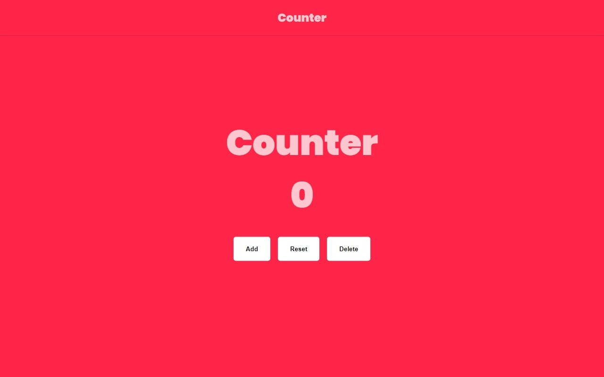
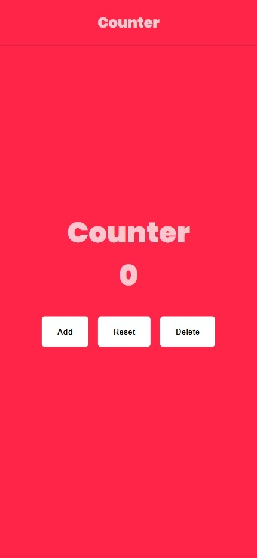

# Counter (2/40)

Welcome to the Counter project! This project is part of the JavaScript projects series from [freeCodeCamp]([https://www.freecodecamp.org/](https://www.freecodecamp.org/news/javascript-projects-for-beginners/)). It's a simple web application that allows you to count and keep track of numbers.

## Table of Contents

- [Demo](#Demo)
- [Features](#Features)
- [Usage](#Usage)
- [Screenshots](#Screenshots)
- [Follow Me](#Follow-Me)

## Demo

You can view a live demo of the Counter Website project [here](https://rebrodie.github.io/Counter/).

## Features

- Increase or decrease the count with the click of a button.
- Reset the count to zero.
- Simple and intuitive user interface.

## Usage

1. Clone the repository:

   ```bash
   git clone https://github.com/your-username/counter-website.git

2. Navigate to the project directory:

   ```bash
   cd background-color-flipper
3. Open index.html in your web browser.
4. Click the buttons to increase, descrease or reset the count.


# Screenshots

## Desktop View


## Mobile View


# Follow Me
- [Twitter](https://twitter.com/Re_brodie)
- [LinkedIn](https://www.linkedin.com/in/malik-bennett-929b5a2b0/)
